# 内存管理

## 伙伴系统层

### 数据结构

#### `frame_t`

用于物理页框管理的结构体, 系统中使用一个全局的 `frame_tab` 数组对所有物理页框进行管理.

|类型|名称|描述|
|-:|:-|:-|
|`uint16_t`|`ref_cnt`|页框的引用计数|
|`uint16_t`|`flag`|页框的标志位集合 3-0位: 伙伴系统中使用的 order 值 4位: 标记该页框是否被用于伙伴系统 5位: 标记该页框是否空闲|
|`void *`|`bkt_desc`|在 kmalloc 存储桶使用, 指向桶相应的描述符地址|
|`list_node`|`chain`|在伙伴链表中使用的节点|

#### `buddy_desc`

伙伴系统的描述符结构体, 对于每个 order 的伙伴链表, 都有一个相应的描述符, 系统中使用一个伙伴目录表 `buddy_dir[11]`, 包含 order 从 0 到 10 的 11 个表项.

|类型|名称|描述|
|-:|:-|:-|
|`uint16_t`|`order`|伙伴链表对应的 order 值|
|`uint16_t`|`list_len`|伙伴链表的长度|
|`list_node`|`head`|伙伴链表的头节点|

### 函数接口

#### `buddy_init`

- 参数与返回值

	|类型|名称|描述|
	|-:|:-|:-|
	|`void *`|`addr`|交给伙伴系统管理的起始物理地址|
	|`size_t`|`n`|交给伙伴系统管理的物理页框个数|
	|`int`|返回值|若初始化成功返回 1, 否则返回 0|

该函数用于伙伴系统的初始化, 主要分为下面几步:

	1. 对伙伴系统目录进行初始化.
	2. 对属于伙伴系统管理的所有页框进行初始化.
	3. 将页框插入到相应 order 的伙伴链表中.

由于给出的地址范围可能并未按照 1K 个页框对齐, 在初始化时要先将地址范围头部的页框依此插入对应 order 的伙伴链表中. 处理完头部的地址空间后, 将按照 1K 个页对齐的地址插入 MAX_ORDER 的链表中, 若之后还存在多余的页框, 再依此将其插入对应 order 的链表中.

#### `buddy_alloc_frames`

- 参数与返回值

	|类型|名称|描述|
	|-:|:-|:-|
	|`size_t`|`n`|要分配的连续页框个数|
	|`void *`|返回值|分配得到的连续页框起始物理地址, 分配失败时返回 `NULL`|

由于输入的 `n` 可能不是 2 的幂次倍, 但 `n` 必然能够表示成多个 2 的幂次数之和, 因此先找到一个页框数大于 `n` 的连续块, 再对其进行拆分, 将头部的 `n` 个页框返回, 而剩余部分回收到伙伴系统中.

如申请 10 个连续块时, 从伙伴链表中取到的是 16 个连续块, 接着将前 10 个块分解为 8+2 个连续块返回.而剩下的 6 个连续块则被分为 2+4 个连续块回收到伙伴系统中.

#### `buddy_free_frames`

- 参数与返回值

	|类型|名称|描述|
	|-:|:-|:-|
	|`void *`|`addr`|要回收的连续页框起始物理地址|
	|`size_t`|`n`|要回收的连续页框个数|
	|`int`|返回值|若回收成功返回 1, 否则返回 0|

与分配时类似, 这里输入 `n` 也可以被写成多个 2 的幂次数之和, 由于在分配时取的是头部块, 因此回收时也只需要依次回收到对应 order 的链表中即可.

如回收 10 个连续块时, 将其分解为 8+2 个连续块依此回收到对应链表中, 如果各个块的伙伴可以合并, 则与之合并成更大的连续块.

## Kmalloc 层

Kmalloc 层使用存储桶对内存进行管理, 即对不同请求的内存块大小, 使用存储桶目录分别进行处理. 其基本结构如下图所示, 通过存储桶可以分配大小从 8B 到 4096B 的不同对象, 其相应链表的头指针保存在存储桶目录中.

### 数据结构

#### `bucket_desc`

桶描述符结构体, 每个桶大小为 1 个页, 相同对象的桶被链入同一个对象链表中.

|类型|名称|描述|
|-:|:-|:-|
|`void *`|`page`|指向桶对应的页|
|`bucket_desc *`|`next`|指向下一个桶的指针|
|`void *`|`free_ptr`|指向桶中的第一个空闲对象|
|`uint16_t`|`ref_cnt`|桶中已被分配的对象个数|
|`uint16_t`|`obj_size`|桶对象的大小|

### 函数接口

#### `kmalloc`

- 参数与返回值

	|类型|名称|描述|
	|-:|:-|:-|
	|`size_t`|`n`|要分配的字节数|
	|`void *`|返回值|分配得到的对象起始地址|

函数执行时首先搜索桶目录, 找到符合大小的描述符链表. 之后在链表中查找具有空闲对象的描述符. 若能找到, 则从该描述符对应的页中分配一个对象返回; 若没有找到, 则先申请一个新的描述符和相应空闲页, 再重复查找过程.

#### `kfree`

- 参数与返回值

	|类型|名称|描述|
	|-:|:-|:-|
	|`void *`|`addr`|要回收的对象起始地址|
	|`void`|返回值|无返回值|

函数首先根据输入的虚拟地址换算得到页框号, 通过相应的 `frame_t` 结构体查找到该对象所属的桶, 之后将对象重新插入到桶描述符中的空闲链表中, 若插入完成后该桶没有被分配的对象, 则可以考虑回收该桶对应的页框.
